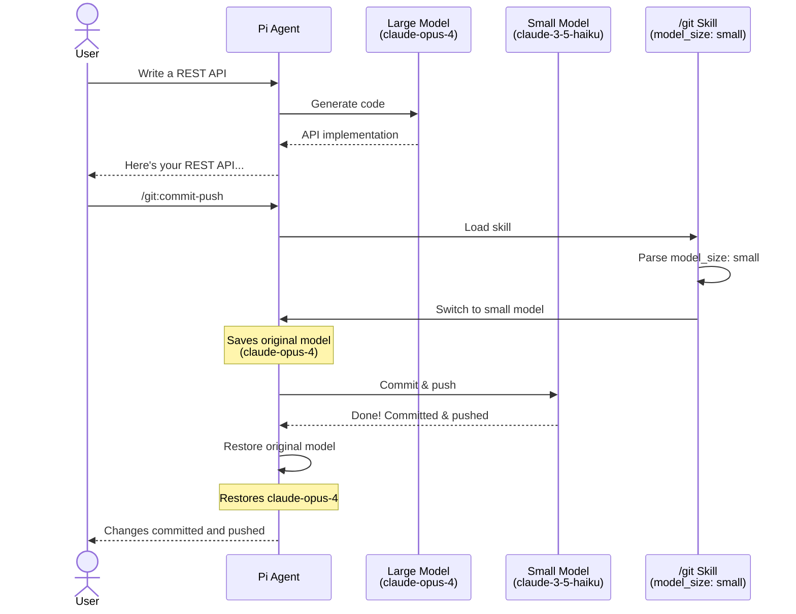
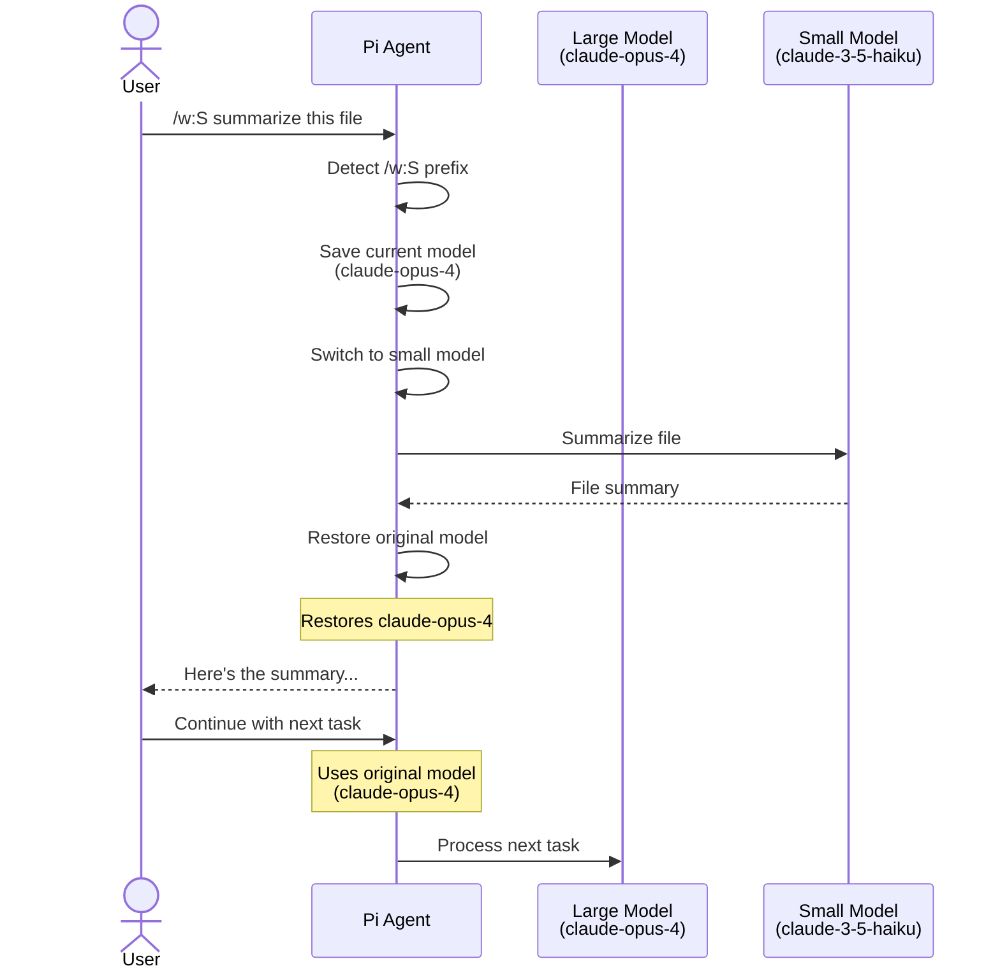

# Pi Model Size Extension

A [pi](https://github.com/badlogic/pi-mono) extension that enables automatic model size selection based on skill requirements.

## Features

- **Skill-based model switching**: Skills can specify a preferred model size (`small`, `medium`, or `large`) in their frontmatter
- **Prompt prefix switching**: Use `/w:S`, `/w:M`, `/w:L` prefix to temporarily switch models for a single prompt
- **Preferred models per size**: Set your preferred model for each size category with `/set-model-size`
- **Automatic size detection**: Known model patterns are automatically classified (e.g., `gpt-*mini`, `haiku`, `gemini-*flash` → small)
- **Custom size overrides**: Models can have custom size assignments in `models.json`
- **Automatic restoration**: Original model is restored after skill execution or prompt completes
- **Manual control**: Commands to view and set model size preferences

## Installation

### Option 1: Pi Package (Recommended)

```bash
pi install https://github.com/championswimmer/pi-model-size-extension
```

### Option 2: Manual Installation

Copy the extension to your pi extensions directory:

```bash
cp index.ts ~/.pi/agent/extensions/model-size/index.ts
```

Or use the `-e` flag for testing:

```bash
pi -e ./index.ts
```

## Usage

### In Skills

Add `model_size` to your skill's YAML frontmatter:

```markdown
---
name: my-fast-skill
description: A skill optimized for small, fast models
model_size: small
---

# My Fast Skill

This skill works best with smaller models for quick responses...
```

Valid values: `small`, `medium`, `large`, or shorthand `S`, `M`, `L`.

When the skill is loaded via `/skill:my-fast-skill`, the extension will:
1. Detect the `model_size: small` in the frontmatter
2. Find the first available small model
3. Switch to that model
4. Restore the original model after the skill execution completes

### Model Size Configuration

#### Default Size Detection

Models are automatically classified by their ID/name patterns:

**Small:**
- Models matching: `mini`, `haiku`, `flash`, `turbo`, `instant`, `lite`, `tiny`, `nano`, `small`

**Large:**
- Models matching: `opus`, `o1`, `o3`, `ultra`, `max`, `pro`, `large`, `big`

**Medium:**
- All other models

#### Custom Size Overrides

Add size overrides in `~/.pi/agent/models.json`:

```json
{
  "providers": {
    "anthropic": {
      "modelOverrides": {
        "claude-sonnet-4": { "size": "medium" }
      }
    },
    "openai": {
      "models": [
        { "id": "gpt-4o", "size": "large" }
      ]
    }
  }
}
```

#### Preferred Models

Set your preferred model for each size category using `/set-model-size`. This preference is stored in `~/.pi/agent/model-preferences.json`:

```json
{
  "preferredModels": {
    "small": "anthropic/claude-haiku-4-5",
    "medium": "anthropic/claude-sonnet-4",
    "large": "anthropic/claude-opus-4"
  }
}
```

When a size is requested (via skills, `/w:S`, etc.), your preferred model for that size is used. If no preferred model is set, the first available model of that size is selected automatically.

### Commands

#### `/model-size`

Show current model size, preferred models, and list available models by size:

```
/model-size
```

Output:
```
Current: anthropic/claude-sonnet-4 (medium)

Preferred models:
  small: → anthropic/claude-haiku-4-5
  medium: → anthropic/claude-sonnet-4
  large: (not set)

Available models by size:

Small:
  anthropic/claude-haiku-4-5
  openai/gpt-4o-mini
  google/gemini-2.0-flash

Medium:
  anthropic/claude-sonnet-4
  openai/gpt-4o

Large:
  anthropic/claude-opus-4
  openai/gpt-4-turbo
```

#### `/set-model-size <size> <model>`

Set your preferred model for a size category. When you use `/w:S`, load a skill with `model_size: small`, or request a small model, your preferred model will be used instead of the default first match.

```
/set-model-size small anthropic/claude-haiku-4-5
/set-model-size medium anthropic/claude-sonnet-4
/set-model-size large anthropic/claude-opus-4
```

**Features:**
- **Autocomplete**: Type `/set-model-size ` and get size suggestions (small/medium/large)
- **Model autocomplete**: After selecting a size, get model suggestions filtered to that size category
- **Persistence**: Preferred models are saved to `~/.pi/agent/model-preferences.json`
- **Fallback**: If no preferred model is set for a size, the first available model of that size is used

**Examples:**
```bash
# Set claude-haiku-4-5 as preferred small model
/set-model-size small anthropic/claude-haiku-4-5

# Set claude-sonnet-4 as preferred medium model
/set-model-size medium anthropic/claude-sonnet-4

# You can also use shorthand size (S/M/L)
/set-model-size S claude-haiku-4-5
```

**Note:** If you specify a model that doesn't match the detected size category, you'll get a warning but the preference will still be saved. This allows flexibility for custom model configurations.

#### `/end-skill`

End skill/prompt mode and restore the original model:

```
/end-skill
```

### Prompt Prefix for Model Selection

You can prefix any prompt with `/w:S`, `/w:M`, or `/w:L` to temporarily use a small, medium, or large model for that specific prompt. The original model is automatically restored after the response completes.

```
/w:S <prompt>    → Uses small model
/w:M <prompt>    → Uses medium model
/w:L <prompt>    → Uses large model
```

#### Small Model Examples (`/w:S`)

Best for quick, simple tasks where speed matters more than depth:

```bash
# Quick formatting
/w:S format this JSON file

# Simple summaries
/w:S summarize this error message in one sentence

# Boilerplate generation
/w:S create a basic Express.js route for GET /users

# Quick explanations
/w:S what does this regex do: /^[a-z]+$/

# Simple conversions
/w:S convert this timestamp to ISO format: 1709877600

# Quick fixes
/w:S fix the syntax error in this line: const x = {a: 1, b: 2,}
```

#### Medium Model Examples (`/w:M`)

Best for balanced tasks requiring moderate reasoning:

```bash
# Standard coding tasks
/w:M implement a rate limiter middleware for Express.js

# Code review
/w:M review this function for best practices and suggest improvements

# Documentation
/w:M write JSDoc comments for this API module

# Refactoring
/w:M refactor this code to use async/await instead of promises

# Testing
/w:M write unit tests for this utility function

# Debugging
/w:M help me debug why this async function hangs sometimes
```

#### Large Model Examples (`/w:L`)

Best for complex tasks requiring deep analysis and reasoning:

```bash
# Architecture design
/w:L design a microservices architecture for an e-commerce platform

# Complex refactoring
/w:L refactor this monolithic API into separate service layers

# Security review
/w:L perform a security audit of this authentication module

# Performance optimization
/w:L analyze and optimize this database-heavy application for scale

# Multi-file analysis
/w:L analyze the dependencies between all files in this project

# Complex problem solving
/w:L help me design a distributed caching strategy for a global application
```

## How It Works

### Skill-based Model Switching



### Prompt Prefix Model Switching



1. **Skill Detection**: On `input` event, the extension checks for `/skill:xxx` commands
2. **Prefix Detection**: Also checks for `/w:S`, `/w:M`, `/w:L` prefixes in prompts
3. **Frontmatter Parsing**: If a skill file is found, it parses the YAML frontmatter for `model_size`
4. **Model Matching**: Finds the first available model matching the requested size
5. **Model Switching**: Saves the current model and switches to the size-appropriate model
6. **Restoration**: On `agent_end` (when no pending messages), restores the original model

## Example Skill

```markdown
---
name: quick-summary
description: Generate quick summaries using fast models
model_size: small
---

# Quick Summary Skill

You are tasked with generating concise summaries.

## Instructions

1. Read the provided content
2. Extract key points
3. Generate a summary in 2-3 sentences

Be brief and focused.
```

## Development

```bash
# Install dependencies
npm install

# Test with pi
pi -e ./index.ts
```

## Example Skills

The `example-skills/` directory contains sample skills demonstrating model size selection:

- **quick-summary** (`model_size: small`): For fast, concise summaries using small models
- **code-review** (`model_size: medium`): Standard code review with balanced depth
- **deep-analysis** (`model_size: large`): Complex reasoning requiring large models

To use these examples:

```bash
# Copy to your skills directory
cp -r example-skills/* ~/.pi/agent/skills/

# Or to project skills directory
cp -r example-skills/* .pi/skills/
```

## License

MIT
