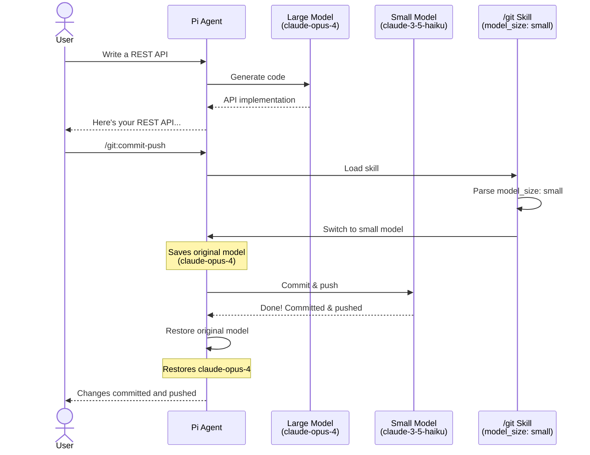

# Pi Model Size Extension

A [pi](https://github.com/badlogic/pi-mono) extension that enables automatic model size selection based on skill requirements.

## Features

- **Skill-based model switching**: Skills can specify a preferred model size (`small`, `medium`, or `large`) in their frontmatter
- **Automatic size detection**: Known model patterns are automatically classified (e.g., `gpt-*mini`, `haiku`, `gemini-*flash` → small)
- **Custom size overrides**: Models can have custom size assignments in `models.json`
- **Automatic restoration**: Original model is restored after skill execution completes
- **Manual control**: Commands to view and set model size preferences

## Installation

### Option 1: Pi Package (Recommended)

```bash
pi install git:github.com/your-username/pi-model-size-extension
```

### Option 2: Manual Installation

Copy the extension to your pi extensions directory:

```bash
cp index.ts ~/.pi/agent/extensions/model-size/index.ts
```

Or use the `-e` flag for testing:

```bash
pi -e ./index.ts
```

## Usage

### In Skills

Add `model_size` to your skill's YAML frontmatter:

```markdown
---
name: my-fast-skill
description: A skill optimized for small, fast models
model_size: small
---

# My Fast Skill

This skill works best with smaller models for quick responses...
```

Valid values: `small`, `medium`, `large`, or shorthand `S`, `M`, `L`.

When the skill is loaded via `/skill:my-fast-skill`, the extension will:
1. Detect the `model_size: small` in the frontmatter
2. Find the first available small model
3. Switch to that model
4. Restore the original model after the skill execution completes

### Model Size Configuration

#### Default Size Detection

Models are automatically classified by their ID/name patterns:

**Small:**
- Models matching: `mini`, `haiku`, `flash`, `turbo`, `instant`, `lite`, `tiny`, `nano`, `small`

**Large:**
- Models matching: `opus`, `o1`, `o3`, `ultra`, `max`, `pro`, `large`, `big`

**Medium:**
- All other models

#### Custom Size Overrides

Add size overrides in `~/.pi/agent/models.json`:

```json
{
  "providers": {
    "anthropic": {
      "modelOverrides": {
        "claude-sonnet-4": { "size": "medium" }
      }
    },
    "openai": {
      "models": [
        { "id": "gpt-4o", "size": "large" }
      ]
    }
  }
}
```

### Commands

#### `/model-size`

Show current model size and list available models by size:

```
/model-size
```

Output:
```
Current: anthropic/claude-sonnet-4 (medium)

Available models by size:

Small:
  anthropic/claude-3-5-haiku
  openai/gpt-4o-mini
  google/gemini-2.0-flash

Medium:
  anthropic/claude-sonnet-4
  openai/gpt-4o

Large:
  anthropic/claude-opus-4
  openai/gpt-4-turbo
```

#### `/set-model-size <size>`

Manually switch to a model of the specified size:

```
/set-model-size small
/set-model-size medium
/set-model-size large
```

Shorthand also works: `/set-model-size S`, `/set-model-size M`, `/set-model-size L`

#### `/end-skill`

End skill mode and restore the original model:

```
/end-skill
```

## How It Works



1. **Skill Detection**: On `input` event, the extension checks for `/skill:xxx` commands
2. **Frontmatter Parsing**: If a skill file is found, it parses the YAML frontmatter for `model_size`
3. **Model Matching**: Finds the first available model matching the requested size
4. **Model Switching**: Saves the current model and switches to the size-appropriate model
5. **Restoration**: On `agent_end` (when no pending messages), restores the original model

## Example Skill

```markdown
---
name: quick-summary
description: Generate quick summaries using fast models
model_size: small
---

# Quick Summary Skill

You are tasked with generating concise summaries.

## Instructions

1. Read the provided content
2. Extract key points
3. Generate a summary in 2-3 sentences

Be brief and focused.
```

## Development

```bash
# Install dependencies
npm install

# Test with pi
pi -e ./index.ts
```

## Example Skills

The `example-skills/` directory contains sample skills demonstrating model size selection:

- **quick-summary** (`model_size: small`): For fast, concise summaries using small models
- **code-review** (`model_size: medium`): Standard code review with balanced depth
- **deep-analysis** (`model_size: large`): Complex reasoning requiring large models

To use these examples:

```bash
# Copy to your skills directory
cp -r example-skills/* ~/.pi/agent/skills/

# Or to project skills directory
cp -r example-skills/* .pi/skills/
```

## License

MIT